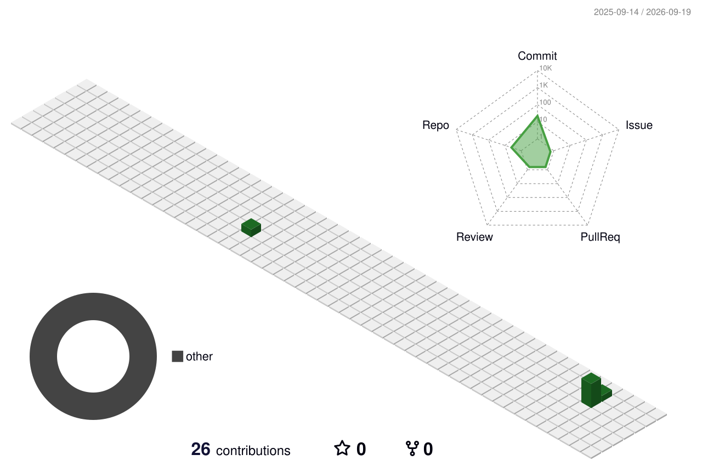

# 👋 Hi, I'm Sumaiya Binte Mizan

### Data Engineer · AI & LLM Integration · Full-Stack Developer · Cybersecurity Enthusiast

  
  

---

## 👨‍💻 About Me

I'm **Sumaiya Binte Mizan**, a passionate **Data Engineer** focused on building practical, scalable and intelligent software systems.

- 🔭 Currently building **Nijer**
- 🌱 Exploring **AI & LLM Integration**
- 🤝 Collaborating on **Kajwala**
- 🧠 Interested in **Data Engineering & Intelligent Applications**
- 💻 Building and improving **Full-Stack Applications**
- 🔐 Exploring **Cybersecurity**
- 📚 Learning, experimenting and growing continuously

---

## 📊 GitHub Analytics

<table>
<tr>
<td width="50%">

</td>
<td width="50%">

</td>
</tr>
</table>

<table>
<tr>
<td width="50%">

</td>
<td width="50%">

</td>
</tr>
</table>

---

## 🛠️ Tech Stack

### 💻 Languages

  

### 🤖 AI · Data · Backend

  

### 🗄️ Databases · Cloud · DevOps

  

### 🎨 Frontend

  

---

## 🚀 Featured Projects

<table>
<tr>
<td width="50%" valign="top">

### 🏠 Nijer

A practical project focused on building a useful real-world application.

**Focus:** Full-Stack Development

</td>

<td width="50%" valign="top">

### 🤖 AI Project

An AI-focused project exploring intelligent application development.

**Focus:** AI · LLM · Software Development

</td>
</tr>

<tr>
<td width="50%" valign="top">

### 🤝 Kajwala

A collaborative project developed with a team.

**Focus:** Collaboration · Full-Stack Development

</td>

<td width="50%" valign="top">

### 🔎 More Projects

Explore my repositories for experiments, learning projects and development work.

</td>
</tr>
</table>

---

## 🐍 Contribution Snake

<picture>
  <source media="(prefers-color-scheme: dark)" srcset="./profile/github-contribution-grid-snake-dark.svg">
  <source media="(prefers-color-scheme: light)" srcset="./profile/github-contribution-grid-snake.svg">
  
</picture>

---

## 🌌 3D Contribution Calendar

<picture>
  <source media="(prefers-color-scheme: dark)" srcset="./profile-3d-contrib/profile-night-green.svg">
  <source media="(prefers-color-scheme: light)" srcset="./profile-3d-contrib/profile-green.svg">
  
</picture>

---

## 📬 Let's Connect

  

**Build · Learn · Experiment · Grow 🚀**

